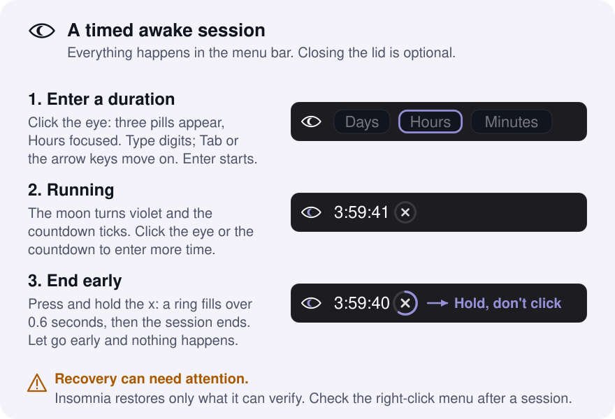
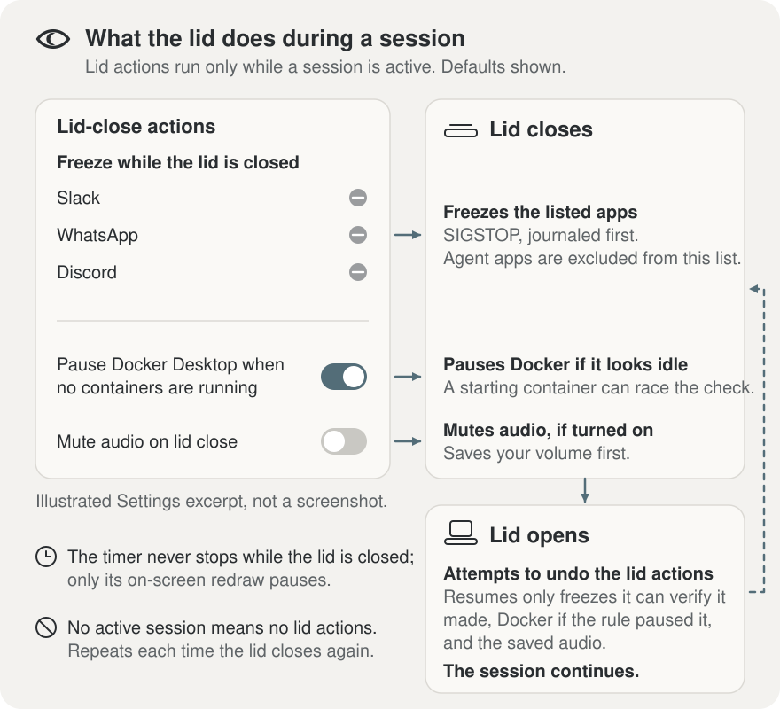
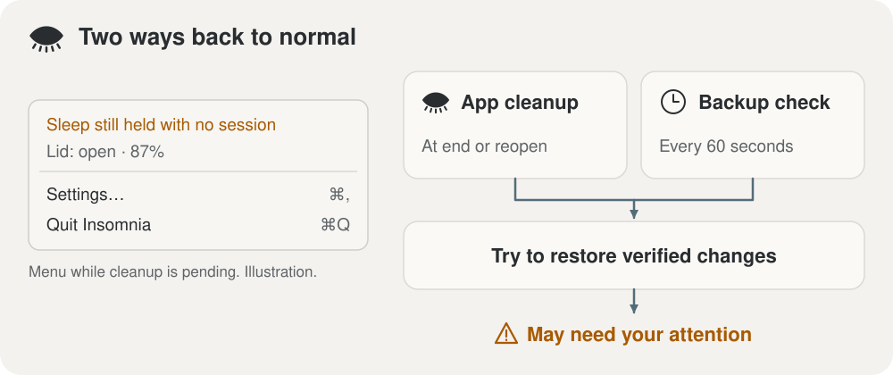

<p align="center">
  
</p>

<h1 align="center">Insomnia</h1>

<p align="center">
  <strong>Keep your Mac awake. Give the session an end time.</strong>
</p>

<p align="center">
  A native macOS menu bar app for timed awake sessions. Pick a duration for your
  long-running work, choose what happens when the lid closes, and see when
  recovery needs your attention.
</p>

<p align="center">
  <a href="#install"><strong>Install</strong></a> ·
  <a href="#using-it"><strong>Using it</strong></a> ·
  <a href="#how-recovery-works"><strong>Recovery</strong></a> ·
  <a href="SECURITY.md"><strong>Security</strong></a>
</p>

<p align="center">
  <a href="https://github.com/kgarg2468/Insomnia/actions/workflows/ci.yml"></a>
  <a href="LICENSE"></a>
  
  
</p>

> **Use a stable, well-ventilated surface—not a closed bag.** Insomnia is
> experimental, source-built software, not a signed and notarized consumer
> download. Recovery can fail; a running timer is not a safety guarantee.
> [Validation status](docs/release-validation.md) · [Apple's ventilation guidance](https://support.apple.com/en-us/102336)

<p align="center">
  
</p>

## Install

Requires **macOS 26 or later** and **Xcode with Swift 6.2 or later**. Installation
currently means building from source:

```bash
git clone https://github.com/kgarg2468/Insomnia.git
cd Insomnia
./scripts/install.sh
open "$HOME/Applications/Insomnia.app"
```

The installer builds and ad-hoc signs the app, installs a background recovery
agent, and asks for administrator access to install a narrowly scoped sudoers
rule. It grants **your user account**, not just Insomnia, passwordless access to
four power-setting commands. Review that permission before installing.

<details>
<summary><strong>Exactly what gets installed</strong></summary>

| Location | Purpose |
| --- | --- |
| `~/Applications/Insomnia.app` | The menu bar app |
| `~/Library/Application Support/Insomnia/` | Configuration, session/recovery journals, and `backstop.sh` |
| `~/Library/LaunchAgents/com.insomnia.backstop.plist` | Per-user recovery agent |
| `~/Library/Logs/Insomnia/` | `insomnia.log` and `handoffs.log` |
| `/etc/sudoers.d/insomnia` | Permission for the four commands below |

```text
/usr/bin/pmset -a disablesleep 1
/usr/bin/pmset -a disablesleep 0
/usr/bin/pmset -b lowpowermode 1
/usr/bin/pmset -b lowpowermode 0
```

The grant is available to other processes running as your user. Insomnia is not
sandboxed. The app, scripts, and journals are local; hotspot passwords use the
login Keychain, not the configuration file.

An upgrade asks the running app to quit and stops if it refuses. Unresolved
recovery prevents replacing the existing recovery agent; follow the reported
instructions before retrying.

</details>

## Using it

1. **Start:** click the eye in the menu bar, enter Days / Hours / Minutes, and
   press Enter.
2. **Extend:** click the eye or countdown during a session and enter more time.
3. **End early:** press and hold the end control beside the countdown.
4. **Inspect or configure:** right-click for status, recovery warnings,
   **Settings**, and **Quit Insomnia**. Quitting requests session cleanup and
   can be refused while required recovery remains.

You do not need to close the lid to use a timed session. Opening the lid does
not end it, and a sleeping display is not the same as a sleeping Mac.

Before the first session, review the settings—some lid actions are enabled by
default. Start with a short, supervised session on a ventilated surface and
check the status menu and `~/Library/Logs/Insomnia/insomnia.log` afterward.

## What happens when the lid closes

<p align="center">
  
</p>

During a session, Insomnia turns the display and keyboard backlight off
(saving their brightness first), can pause selected background apps, check
whether Docker Desktop is idle before pausing it, and save then mute audio.
Reopening the lid attempts to undo those lid actions. **The timer keeps
counting down while the lid is closed**; only its on-screen redraw pauses.

The display step exists because the sleep guard stops macOS from doing it:
with sleep disabled, closing the lid no longer turns the panel or the keys off
by itself. Insomnia sets both to zero and restores them when the lid opens. If
Insomnia is not running when you open the lid, press the brightness-up key.

The defaults are worth knowing:

- **Selected apps:** Slack, WhatsApp, and Discord are on the freeze list.
  Configured agent apps are excluded from this ordinary list.
- **Docker rule:** enabled, with a separate local Docker Desktop idle check.
  Container startup can race that check; disable the rule for important Docker
  workloads where an unexpected pause would be disruptive.
- **Mute on close:** off.
- **Display and keyboard backlight:** on ("Turn off the display and keyboard
  backlight" in Settings). Both values are saved to the journal before they
  are changed.
- **Battery rules:** below 40% on battery, request Low Power Mode; below 10%,
  end the session. Serious thermal state requests Low Power Mode; critical
  thermal state ends the session. These rules require the app to be running.

To exercise the lid actions without closing the lid, run
`scripts/simulate-lid.sh closed` and then `scripts/simulate-lid.sh open` during
a session; the app runs the same actions it would on a real lid event.

## How recovery works

<p align="center">
  
</p>

Insomnia records pending changes in a recovery journal. On session end, the app
attempts to undo them. An independent `launchd` agent checks every minute and
can attempt recovery after the app exits unexpectedly, once the saved deadline
has passed. It leaves a valid, unexpired session alone.

The app and backstop use the same lock so they do not restore and rewrite the
journal over one another. Failed restoration keeps the relevant entries;
unreadable journals are preserved instead of treated as clean.

**Recovery is not “everything always gets undone.”** The backstop does not
monitor battery or temperature. Saved audio needs the app to reopen, and
unconfirmed process freezes may need manual inspection. If a warning remains,
resolve it before leaving the Mac unattended. Real-machine crash, reboot, and
installation scenarios still need [release validation](docs/release-validation.md).

<details>
<summary><strong>Recovery limits and manual attention</strong></summary>

- **Process ownership:** automatic resume checks the recorded process start
  time and boot session. Old identity-less entries, or a crash/write failure
  before a freeze is confirmed, are not automatically resumed while stopped.
  Verify the live process and whether it should be resumed; never blindly
  signal a PID from an old log.
- **Identity is not an atomic guarantee:** the app checks start time to the
  microsecond; the shell checks to the second. A lookup and a signal are still
  separate operations.
- **Stuck power commands:** a command that survives its timeout keeps the
  recovery lock until it exits. Other recovery attempts or new sessions wait
  or fail with a warning instead of running alongside it.
- **Audio:** the backstop preserves volume/mute entries but cannot restore
  CoreAudio. Reopen the app for recovery.
- **Low Power Mode:** Insomnia checks the existing setting so it does not
  claim ownership of an already-enabled preference.
- **App Nap:** preferences applied to configured agent apps intentionally
  persist after session end and uninstall.
- **Uninstall:** refuses to remove recovery machinery while unresolved changes
  remain. A failed uninstall is not confirmation that power settings are normal.

</details>

## Optional extras

<details>
<summary><strong>iPhone hotspot handoff and tmux</strong></summary>

Set **System Settings → Wi-Fi → Ask to join hotspots → Automatically**, then
enter the hotspot SSID and password in Insomnia Settings. The password is
stored in the login Keychain under service `insomnia-hotspot`. Insomnia uses
CoreWLAN to find and join that network without putting the password in process
arguments.

macOS requires Location Services permission to reveal network names. Insomnia
requests it on the first hotspot save, or when starting a session with a
configured hotspot—not merely on launch. If denied, use the Location row in
Settings to open **Privacy & Security → Location Services**.

Configured tmux targets opt into sending `continue` followed by Enter after a
long outage (90 seconds by default). The default target list is empty. Use
dedicated, disposable agent panes: pending text is opaque to Insomnia, and
Enter can submit it too. Ending a session cancels pending automation but cannot
retract keystrokes already sent.

</details>

<details>
<summary><strong>Chrome, Chromium, and Arc throttling</strong></summary>

Chromium browsers can throttle windows macOS considers occluded, including
when the lid is closed. Insomnia detects supported running browsers missing
`--disable-backgrounding-occluded-windows` or `--disable-renderer-backgrounding`
and offers **Relaunch [browser] unthrottled** in the right-click menu. Relaunch
preserves browser profile arguments. This is not a guarantee that every web
app will keep working while the lid is closed.

</details>

<details>
<summary><strong>Configuration and privacy</strong></summary>

Configuration lives in `~/Library/Application Support/Insomnia/config.json`.
Use Settings for the app's controls; [Config.swift](Sources/Insomnia/Model/Config.swift)
defines the full configuration and defaults. Local logs can contain SSIDs,
process metadata, and tmux targets. Check them before sharing publicly.

`INSOMNIA_HOME` relocates app support files, logs, and LaunchAgents for testing.
It is **not an installation sandbox**: installation/removal also involves the
app bundle and sudoers rule. The installer refuses a relocated home. See
[Paths.swift](Sources/Insomnia/Store/Paths.swift) for the layout.

</details>

## Uninstall

From your checkout:

```bash
./scripts/uninstall.sh
# Also remove Insomnia-owned configuration and logs:
./scripts/uninstall.sh --purge
```

The uninstaller requests cleanup before removing the app, agent, and sudoers
rule. If recovery is incomplete or the app refuses to quit, it stops; resolve
the reported problem and retry. Purge removes owned files, not arbitrary
directory contents. A small shared lock file is retained to keep concurrent
recovery operations coordinated.

## Development

```bash
swift build
swift test
```

CI runs Swift tests, a release build, and ShellCheck. tmux integration tests
need tmux installed; check skip counts rather than assuming missing integration
coverage passed. Tests use injected dependencies and temporary fixtures—not
live installation or power changes on a contributor's machine.

The app icon and menu-bar mark share [vector geometry](Sources/Insomnia/UI/EyeMoonGeometry.swift).
After changing the artwork, run `./scripts/generate-app-icon.sh` to regenerate
the packaged PNG and ICNS assets. No image-generation service is needed.

[Contributing](CONTRIBUTING.md) · [Security reporting](SECURITY.md) ·
[Release validation](docs/release-validation.md) · [Design notes](docs/spec.md)

## License

[MIT](LICENSE)
